# Dominant Psychosocial Response & Distress Classification in Oncology-Related Messages

An NLP course project (HIT, LLM/GenAI course). The project defines a **novel, two-label text
classification task** on oncology-related messages, builds a **fully synthetic, label-leakage-controlled
dataset** for it, and compares **three model families** (a sparse lexical baseline, a fine-tuned
transformer, and a zero-shot model) with a rigorous, bootstrap-based evaluation and an independent
human validation.

---

## 1. Project motivation

A cancer diagnosis carries a heavy psychosocial burden, and supportive-care teams increasingly want
to triage the emotional state behind patient-generated text (forum posts, messages, intake notes).
Two questions matter clinically: **which psychosocial response dominates** a message, and **how
intense the distress** is. Doing this at scale needs an automated classifier, but there is **no public
labeled dataset** for this specific framing, and emotional labels are **subjective and expensive** to
annotate. This project therefore generates its own data synthetically and studies which modelling
approach is actually justified for the task.

## 2. Problem statement

Given a single oncology-related message in English, predict **two labels**:

- **Dominant psychosocial response** - a 7-way single-label classification:
  `anxiety, sadness, anger, hope, guilt, denial, acceptance`.
- **Distress intensity** - a 3-level **ordinal** classification: `low < medium < high`.

Formally: `f(text) -> (response in 7 classes, distress in {low, medium, high})`. The two labels are
predicted by separate models. Distress is treated as ordinal (the distance low->high is worse than
low->medium), so it is evaluated with ordinal-aware metrics.

**Novelty.** The task itself (dominant *psychosocial response* + ordinal distress on oncology
messages), the **attribute-based synthetic corpus** built for it, and the **label-leakage-controlled**
generation protocol (the text never explicitly names the target response label) together form the contribution. Unlike
prior cancer peer-support emotion classification based on broad sentiment categories (e.g. Xu et al.,
2026), this project jointly studies fine-grained psychosocial response type and ordinal distress
intensity using an attribute-controlled synthetic corpus, dual-LLM auditing, quality tiers, and blind
human validation. This is not a re-run of a public benchmark.

## 3. Visual abstract

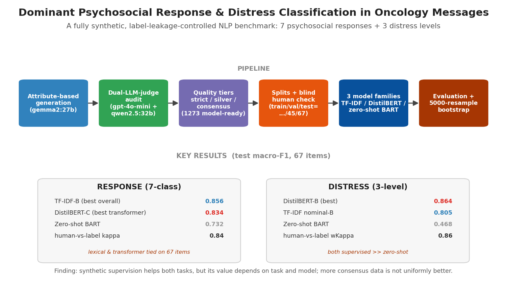

The end-to-end pipeline (attribute-based generation -> dual-LLM-judge audit -> quality tiers ->
splits + blind human check -> three model families -> bootstrap evaluation) and the headline results
for both tasks.

## 4. Datasets used or collected

The corpus is **fully synthetic** (no real patient data) and was generated and audited locally. The
audited corpus is organized into **quality tiers** by how strongly two independent LLM judges agreed
with the intended label.

Tier files (`data/gen_v6_low_medium/tiers/`):

| Tier | Records | Meaning |
|------|---------|---------|
| strict | 471 | both judges confirmed the intended label (highest quality) |
| silver | 75 | partial / single-judge agreement |
| consensus (relabelled) | 727 | label set to the judges' consensus where it differed from intended |
| **model-ready** | **1273** | strict + silver + consensus, used for modelling |

**Class balance (model-ready, n = 1273).** Response: anxiety 458, guilt 234, hope 201, sadness 177,
anger 90, denial 57, acceptance 56. Distress: low 333, medium 694, high 246. Message length: min 4,
median 31, mean 33.1, max 107 words.

> The distributions reflect the generation and auditing pipeline, **not estimated real-world
> prevalence** of these responses or distress levels in oncology populations.

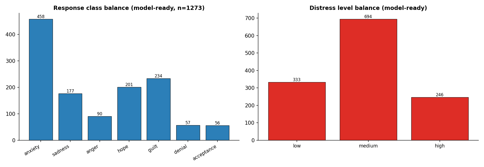

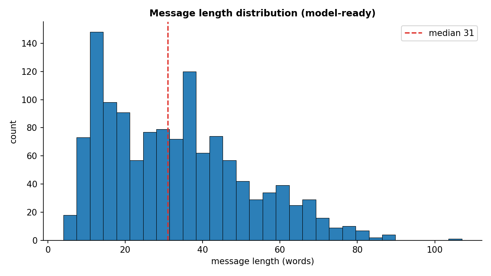

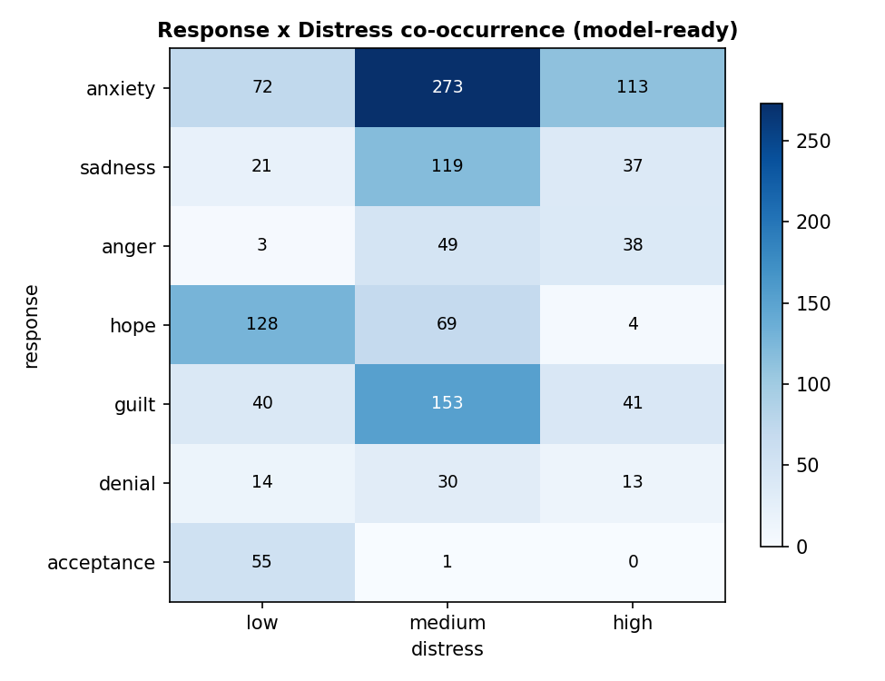

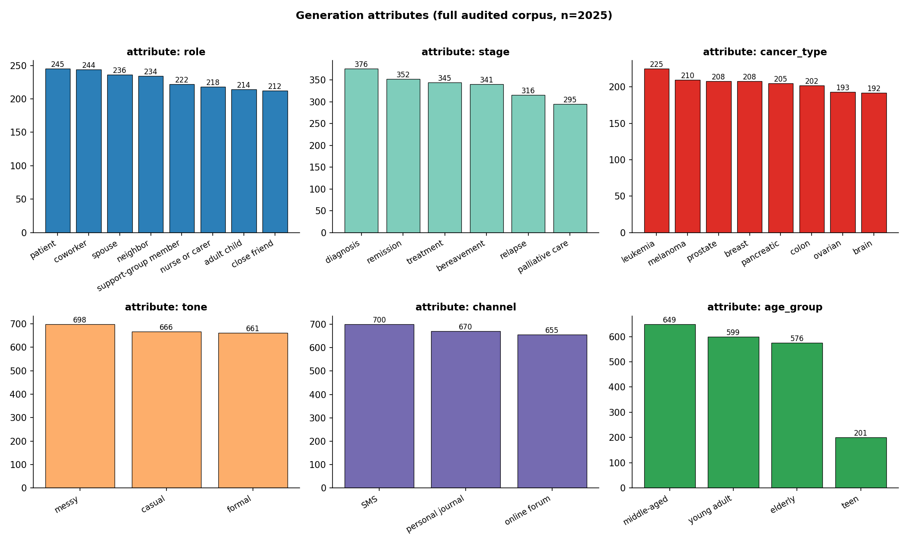

**Splits** (`data/gen_v6_low_medium/splits/`, seed 42):

| Split | Size | Notes |
|-------|------|-------|
| test | 67 | frozen strict-tier items, used only for final evaluation |
| validation | 45 | model selection / threshold tuning |
| train_A | 359 | strict only |
| train_B | 434 | strict + silver |
| train_C | 1161 | strict + silver + consensus |

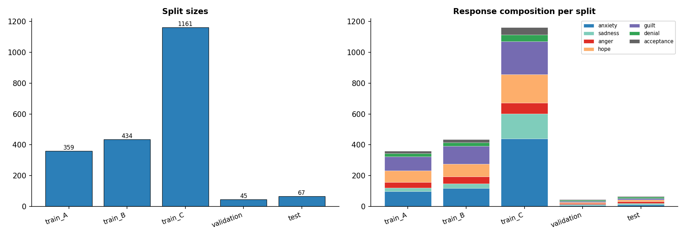

The three training tiers (A/B/C) let us measure whether **more synthetic data of decreasing purity**
helps. The 67-item test set was **independently re-annotated by a human** (see section 10) to validate
the synthetic labels before any model was trusted.

## 5. Data augmentation and generation methods

The method is **attribute-based synthetic generation with dual-LLM-judge validation** and a strict
**label-leakage ban**:

1. **Attribute space.** Each message is generated from a sampled combination of attributes:
   `role` (patient/caregiver/...), cancer `stage`, `cancer_type`, `tone`, `channel`, `age_group`,
   `length`, and a `noisy` flag. Sampling the attribute grid enforces diversity and coverage
   (the named "attribute-based generation" approach).
2. **Conditional generation.** A local generator (`gemma2:27b` via Ollama) is prompted with the
   sampled attributes **and an intended (response, distress) label**, and asked to write a natural
   message that expresses that state **without ever naming the emotion** (no "I am anxious"): this is
   the label-leakage ban, so a classifier cannot cheat on a keyword.
3. **Rejection sampling.** Generations that drift from the intended label or violate constraints are
   rejected and regenerated, with realistic non-uniform quotas per class.
4. **Dual-LLM-judge blind audit.** Two independent judges (`gpt-4o-mini` and `qwen2.5:32b`) read the
   text **without** seeing the intended label and predict (response, distress). Judge agreement with
   the intended label assigns each item to a quality tier (strict / silver / consensus).
5. **Tiering and relabelling.** Where both judges disagreed with the intended label, the consensus
   judge label is adopted (consensus tier); fully confirmed items form the strict tier.

This mirrors three lines of prior work: attribute-conditioned data generation, the known sensitivity
of synthetic data to **label subjectivity**, and the **LLM-as-judge** paradigm for scalable
annotation (see `INTERIM_PAPERS.md` for the reviewed references).

## 6. Input / Output examples

Input is the raw message string; output is the pair (response, distress). Examples below are
representative of the corpus (synthetic, leakage-controlled - note that none names the target
emotion):

**Example 1**
- Input: *"Scan is on Thursday. I keep rereading the same line of a book and nothing goes in, and I have checked my phone for the clinic's number about ten times tonight."*
- Output: `{"response": "anxiety", "distress": "medium"}`

**Example 2**
- Input: *"We met the surgeon and went through the plan step by step. I have written the dates on the kitchen calendar and told work I will be out that week."*
- Output: `{"response": "acceptance", "distress": "low"}`

**Example 3**
- Input: *"They moved the transplant date again. My chest is tight, I cannot get a full breath, and my hands will not stop shaking while I type this."*
- Output: `{"response": "anxiety", "distress": "high"}`

JSON record schema (corpus): `text`, `intended_response`, `intended_distress`, `final_response`,
`final_distress`, `judge_a`, `judge_b`, `quality_tier`, `attributes{...}`, `id`.

## 7. Models and pipelines used

Three model families are compared on **both** tasks (per the course requirement: fine-tuned vs.
off-the-shelf):

- **Sparse lexical baseline - TF-IDF + Logistic Regression.** TF-IDF features + multinomial logistic
  regression (class-weighted). For distress, two variants: **nominal** (direct 3-class) and an
  **ordinal** two-threshold formulation (`P(y>low)`, `P(y>medium)`, validation-tuned thresholds,
  monotonic correction).
- **Fine-tuned transformer - DistilBERT** (`distilbert-base-uncased`) with a classification head,
  fine-tuned separately for response (7 classes) and distress (3 levels), with class-weighted
  cross-entropy.
- **Off-the-shelf zero-shot - BART-MNLI** (`facebook/bart-large-mnli`) natural-language-inference
  zero-shot classification (two prompt templates averaged for distress).
- **Trivial baseline - Majority class** (sanity floor).

Pipeline: generation (`p1`/`p2`) -> dual-judge audit (`p1b`) -> tiers (`p3`) -> splits + class
weights (`p4`) -> blind human check (`p5`) -> fine-tuning (`p6` response, `p7` distress) ->
diagnostics (`p8`) -> baselines (`p9` response, `p9b` distress) -> bootstrap (`p10` response, `p11`
distress) -> human-reference evaluation (`p12`) -> EDA (`p13`).

## 8. Training process and parameters

DistilBERT fine-tuning (identical regime for both tasks):

| Setting | Value |
|---------|-------|
| base model | `distilbert-base-uncased` |
| seeds | 13, 42, 73, 101, 2026 (5 runs; report mean +/- std) |
| max epochs | 12, early stop (patience 2, min-improvement 0.005 val macro-F1) |
| batch size | 16 |
| learning rate | 2e-5 (linear schedule, warmup ratio 0.10) |
| weight decay | 0.01 ; max grad norm 1.0 |
| max token length | 128 |
| loss | class-weighted cross-entropy (weights = N / (num_classes * n_c), cap 5.0) |
| model selection | best validation **macro-F1** |
| hardware | single NVIDIA RTX 5090 (CUDA 12.8), PyTorch 2.11.0+cu128, transformers 5.12.1 |

For each tier (A/B/C) a separate model is trained; the **weighted vs. unweighted** contribution is
isolated with a controlled run on the best distress tier (see Results). TF-IDF + LogReg uses
class-weighted multinomial logistic regression; zero-shot uses no training.

## 9. Metrics

- **Primary:** macro-F1 (equal weight to every class; appropriate for imbalanced multiclass data).
- **Response also:** micro/macro precision/recall/F1, and a **minority macro-F1** =
  mean F1 over the rare classes (anger, denial, acceptance).
- **Distress also (ordinal):** linear and quadratic **weighted Cohen's kappa**, **mean absolute
  ordinal error (MAE)**, exact accuracy, **severe-error rate** (low<->high), adjacent-error rate, and
  per-level precision/recall/F1.
- **Significance:** **5000-resample stratified paired bootstrap** with 95% confidence intervals
  (per-system absolute CIs and paired difference CIs). A difference is called reliable only if its CI
  excludes 0.
- **Human agreement:** Cohen's kappa (response) and weighted kappa (distress) between the blind human
  annotator and the synthetic labels on the 67-item test set.

## 10. Results

### 10.1 Cross-task summary (test macro-F1, 67 items)

| Task | Best lexical | Best transformer | Zero-shot | Reliable conclusion |
|------|--------------|------------------|-----------|---------------------|
| Response | **TF-IDF-B = 0.856** | DistilBERT-C = 0.834 | BART = 0.732 | supervised TF-IDF reliably > zero-shot |
| Distress | TF-IDF-nom-B = 0.805 | **DistilBERT-B = 0.864** | BART = 0.468 | **both** supervised systems reliably > zero-shot |

The lexical-vs-transformer differences were **not resolved** by the 67-item test (paired bootstrap CIs
included 0).

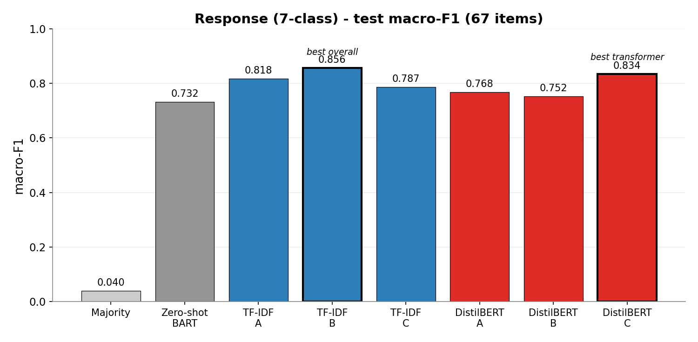

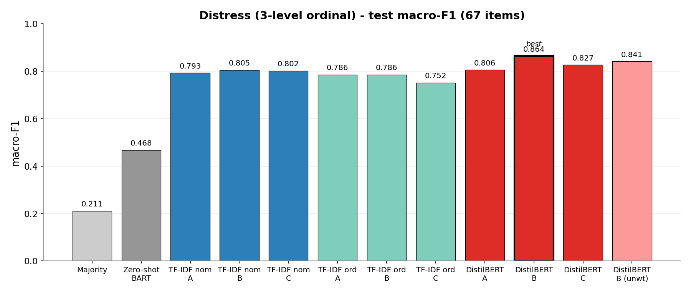

**Distress headline.** DistilBERT-B achieved the highest mean distress performance (macro-F1 0.864,
linear weighted kappa 0.851, MAE 0.113). However, its advantage over TF-IDF-B was not resolved
reliably on the 67-item test. Both supervised systems substantially and bootstrap-reliably
outperformed zero-shot BART.

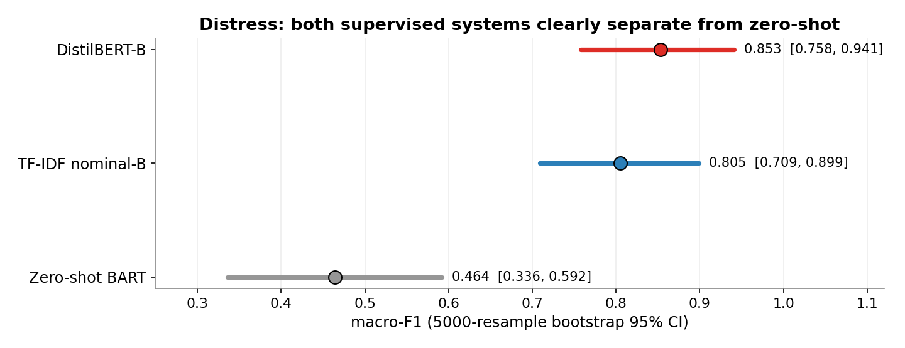

**Cross-task reading.** The two tasks responded differently to model family and synthetic-data tier.
Response labels were highly accessible to a sparse lexical classifier, whereas distress showed a
larger descriptive advantage for the fine-tuned transformer and a much larger gap between supervised
and zero-shot systems. Distress appeared to benefit more from contextual fine-tuning than response
classification - but TF-IDF-B still reached 0.805, so this is a descriptive advantage, not proof that
distress requires a transformer.

### 10.2 Synthetic-data tiers (does more data help?)

DistilBERT macro-F1 by tier: response A 0.768 / B 0.752 / **C 0.834**; distress A 0.806 / **B 0.864**
/ C 0.827. TF-IDF peaks at **B** in both tasks (response 0.856, distress 0.805).
**More synthetic data is not uniformly better:** the peak
tier depends on the task and the model. For response, DistilBERT had its highest mean on tier C, though
the C-vs-A difference was not statistically resolved; for distress, consensus data slightly hurt.

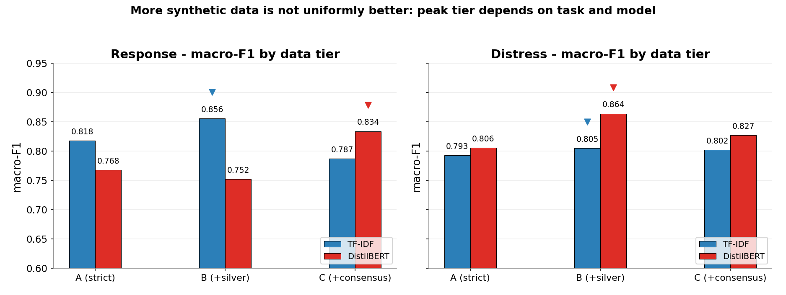

### 10.3 Class-weighting control (distress, DistilBERT-B)

Weighted vs. unweighted, same split / seeds / hyperparameters:

| metric | weighted-B | unweighted-B | delta |
|--------|-----------|--------------|-------|
| macro-F1 | 0.864 | 0.841 | +0.023 |
| weighted kappa (lin) | 0.851 | 0.828 | +0.023 |
| MAE (ordinal) | 0.113 | 0.128 | -0.015 (better) |
| severe (low<->high) | 0.000 | 0.000 | no change |

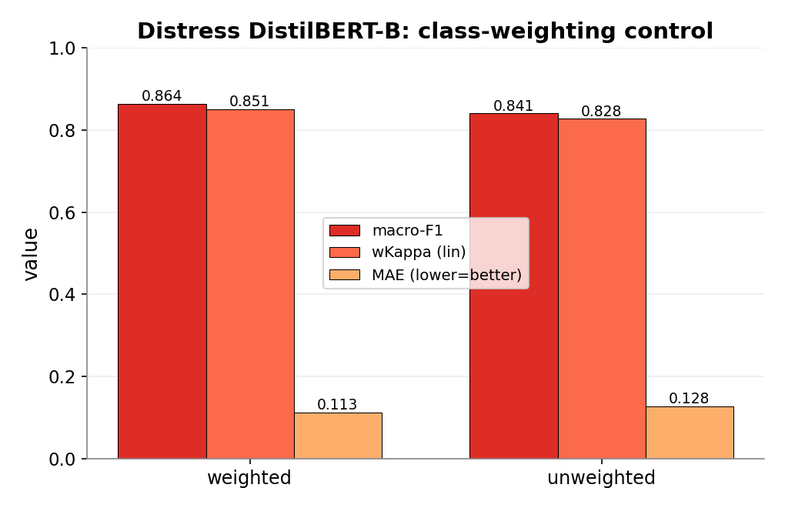

Class weighting gives a modest but real gain, concentrated on the harder **low** level (weakest recall
in the unweighted run), without harming the zero-severe-error profile.

### 10.4 Error analysis (three cases)

- **Response - anger artifact.** anger has high strict-label F1 but low alignment with the independent
  human reading; the model appears more closely aligned with the dual-judge annotation policy than
  with the independent annotator's reading (in oncology text, anger is often expressed as grief/protest
  that a human reads as sadness).
- **Response - anxiety over-prediction.** the consensus tier (C) inflated anxiety in training; the
  predicted/support ratio rose. The cause is **data composition**, not the class weights.
- **Distress - low/medium boundary.** the dominant disagreement, both vs. human and across models:
  systematic **human-low -> model-medium** shift.
  high distress is detected reliably on the synthetic test set, and extreme low<->high errors are
  essentially absent in the trained models.

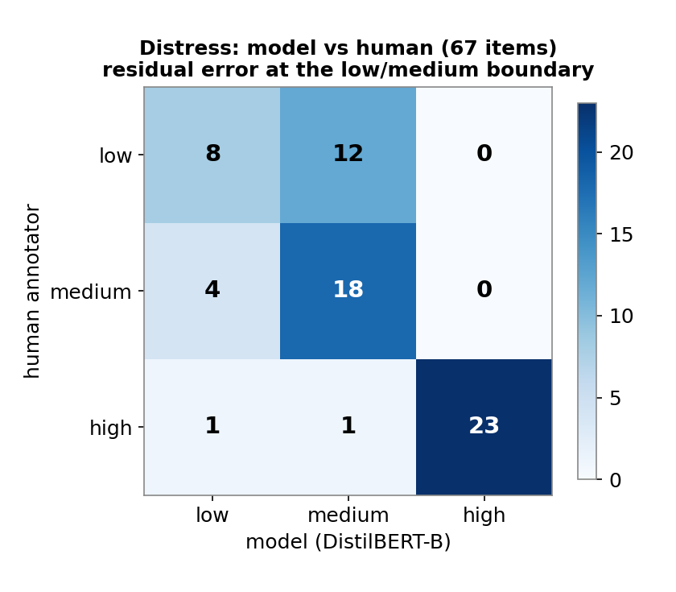

### 10.5 Human validation (67-item test, single blind annotator)

Response: exact agreement 86.6%, Cohen's kappa 0.84. Distress: exact 83.6%, weighted kappa 0.80
(linear) / 0.86 (quadratic). Agreement was **strong on human-unambiguous items and substantially
weaker on human-ambiguous items** (distress weighted kappa 0.82 vs. 0.37), with most disagreement at
the low/medium boundary.

> The distinction between low and medium distress was the least reliable part of the annotation scheme
> and remained sensitive to subjective interpretation.

> Human-reference evaluation was based on **one annotator** and therefore measures agreement with one
> independent reading rather than agreement with a multi-annotator gold standard.

### 10.6 Final cross-task conclusion

Task-specific synthetic supervision was consistently useful, but its value depended on both the task
and model family. Sparse lexical models were highly competitive for response classification, while
distress showed a larger descriptive advantage for contextual fine-tuning. Increasing the amount of
consensus-labelled data did not uniformly improve performance and sometimes transferred
annotation-policy artifacts or class imbalance. Human validation showed that the largest residual
errors were concentrated in semantically ambiguous boundaries rather than extreme ordinal errors.
These classifiers are research prototypes evaluated on synthetic text and are not validated for
clinical triage or individual-level decision-making.

## 11. Repository structure

```
nlp-oncology-psychosocial-response/
  README.md
  .gitignore
  requirements.txt
  slides/                         # proposal/interim/final, PPT and PDF
  code/                                # all Python scripts
    check_setup.py                     # 0. verify generator + both judges are reachable
    p1.py                              # 1. attribute-based synthetic generation (gemma2:27b)
    p1b_audit.py                       #    blind dual-judge audit (gpt-4o-mini + qwen2.5:32b)
    p1c_metrics.py                     #    agreement metrics over the audited dataset (no model)
    p2_validated_gen.py                # 2. validated generation w/ rejection sampling (full + topup)
    merge_pools.py                     #    merge full + topup candidate pools -> merged/candidates.jsonl
    p3_build_tiers.py                  # 3. assign strict / silver / consensus / review tiers
    p4_split.py                        # 4. test/val (strict) + train_A/B/C + response class weights
    p7a_distress_weights.py            #    distress class weights per train set (A/B/C)
    p5_human_check_ml.py               # 5. blind human annotation + scoring of the test set
    p6_train_distilbert.py             # 6. fine-tune DistilBERT - response (7-way), 5 seeds
    p7_train_distress.py               #    fine-tune DistilBERT - distress (3-level), 5 seeds
    p9_baselines.py                    # 7. response baselines: majority / TF-IDF / zero-shot
    p9b_distress_baselines.py          #    distress baselines: majority / TF-IDF nom+ord / zero-shot
    p8_diagnostics.py                  # 8. response error diagnostics (anger, anxiety)
    p10_bootstrap.py                   # 9. response stratified paired bootstrap
    p11_distress_bootstrap.py          #    distress bootstrap + single-system CIs
    p12_distress_human_eval.py         #    distress human-reference evaluation
    p13_eda.py                         # 10. EDA figures + summary
  data/
    raw_dataset.csv  raw_dataset.jsonl       # p1 initial generation (raw, pre-audit)
    pilot_audited.csv  pilot_audited.jsonl    # p1b pilot dual-judge audit output
    gen_v5_validated/
      pilot/                                  # earlier validated-gen pilot
        accepted.jsonl  candidates.jsonl
    gen_v6_low_medium/                        # main experiment
      full/                                   # main p2 run: accepted.jsonl + candidates.jsonl
      topup/                                  # top-up p2 run: candidates.jsonl
      merged/                                 # merge_pools output: candidates.jsonl  (p3's input)
      tiers/                                  # dataset_{strict,silver,consensus_relabelled,model_ready,
                                              #   review_only,all}.jsonl, needs_rejudging.jsonl, tier_summary.txt
      splits/                                 # train_A/B/C, validation, test, test_with_human_annotations,
                                              #   class_weights_{A,B,C}, distress_weights_{A,B,C},
                                              #   human_annotations_<annotator>, human_check_report, human_confirmed/
  results/
    baselines/                    # response: majority_{A,B,C}, tfidf_logreg_{A,B,C}, zeroshot_bart (JSON)
    distress_baselines/           # distress: majority / tfidf_nominal / tfidf_ordinal / zeroshot (JSON)
    bootstrap/                    # bootstrap_response.json, bootstrap_distress.json
    distress_human_eval.json      # human-reference eval marker
    eda_summary.txt               # p13 corpus summary
  visuals/                        # 6 eda_*.png (incl. eda_overview_slide) + 6 results_*.png
                                  #   + visual_abstract.png   (13 figures total)
  report/                         # academic report: PDF + LaTeX source + hit_logo.png
  docs/                           # PROJECT_MEMORY.md, EXECUTION_LOG.md, FINAL_FRAMING.md (optional)
```

Trained model checkpoints under `models/` are **not** committed (too large); they are reproduced by
the training scripts. See `.gitignore`.

## 12. Team Members

- **K.T.** - sole author (data generation, modelling, evaluation, analysis, write-up).
- Course: HIT LLM/GenAI course (A.A.). Solo project.

---

## Reproducibility

**Environment:** Windows 11, Python 3.10.10, local virtual environment (not Docker), NVIDIA RTX 5090,
CUDA 12.8. Key packages: `torch==2.11.0+cu128`, `transformers==5.12.1`, `scikit-learn`, `numpy`,
`matplotlib`, `tqdm` (full list in `requirements.txt`). Local LLMs via Ollama (`gemma2:27b`,
`qwen2.5:32b`); `gpt-4o-mini` judge via API.

**Run order (from the project root, with the venv active):**

0. `py check_setup.py` - verify the generator and both judges are reachable.
1. `py p2_validated_gen.py` - attribute-based, leakage-controlled validated generation (gen + dual-judge
   inline). Run once for the main pool and once for a top-up pool to reach 2000+ audited messages.
   (`p1.py` + `p1b_audit.py` + `p1c_metrics.py` are the earlier single-pass generator, blind dual-judge
   audit, and audit-quality metrics.)
2. `py merge_pools.py` - merge the full and top-up candidate pools into `merged/candidates.jsonl`.
3. `py p3_build_tiers.py --candidates data\gen_v6_low_medium\merged\candidates.jsonl` - assign strict /
   silver / consensus / review tiers.
4. `py p4_split.py` then `py p7a_distress_weights.py` - build train_A/B/C, validation, test, response
   class weights (seed 42), and distress class weights.
5. `py p5_human_check_ml.py annotate ...` then `... score ...` - blind human annotation of the 67-item
   test set (already done; outputs in `splits/`).
6. `py p6_train_distilbert.py` (response) and `py p7_train_distress.py` (distress) - per tier, 5 seeds.
7. `py p9_baselines.py` / `py p9b_distress_baselines.py` - TF-IDF + zero-shot + majority.
8. `py p8_diagnostics.py` - response error diagnostics.
9. `py p10_bootstrap.py` / `py p11_distress_bootstrap.py` - 5000-resample paired bootstrap.
10. `py p12_distress_human_eval.py` - human-reference evaluation.
11. `py p13_eda.py` - EDA figures + summary.

Distress weighted-vs-unweighted control:
`py p7_train_distress.py --train data\gen_v6_low_medium\splits\train_B.jsonl --val ...\validation.jsonl --test ...\test.jsonl --no-weights --out models\distilbert_distress_B_unweighted --tag B_unweighted`

**Important:** the 67-item **test set is never used for tuning** (no hyperparameter, threshold, or
model selection on test). Thresholds and model selection use the 45-item validation set only. All
randomness is seeded; transformer results are reported as mean +/- std over 5 seeds.
